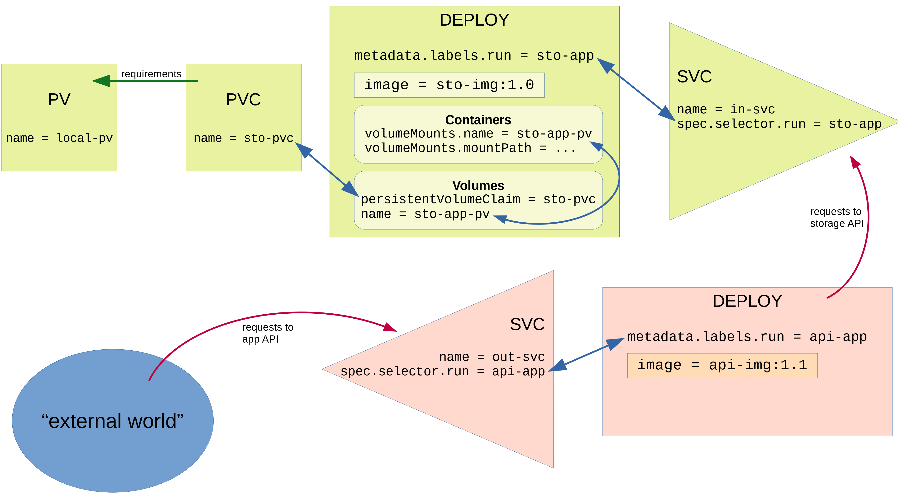

# First steps

Welcome to "Your first nontrivial architecture on Kubernetes"!

This is a reproducible account of my first baby steps to take some simple
"application" and deploy it within K8s. The focus is on the architecture,
so don't be disappointed if the applications themselves are less than your
typical "hello world".

### Pre-requisites

You need a [dockerhub](https://hub.docker.com/) account,
Docker installed and a Kubernetes cluster accessible with `kubectl`.

In particular, Docker should be aware of your dockerhub
account. In practice make sure the `docker login` command
returns something like `Login Succeeded`:
it will then be able to push container images there for you.

## Step 1: dockerize something

First step is, you have an application running as stand-alone
and you want to pack it into a Docker image.

### Develop your app

The application is a very simple Python app written in Flask.
We will use Python 3.6.
The project is made by two files, a `requirements.txt` with just:

    Flask==2.0.1

and an `app.py` with:

```
from flask import Flask

app = Flask('DApp')

@app.route('/')
def home():
    return {'a': 1}

@app.route('/info')
def info():
    return {'info': True}

app.run(host='0.0.0.0')
```

Create these two files in a new directory. To have this running you may
want to keep a dedicated Python virtualenv. Anyway, once you install your
dependencies with

    pip install -r requirements.txt

you can launch the API with

    python app.py

At this point you can test it works with something like

    curl localhost:5000/
    curl localhost:5000/info

_Note: not fit for production! You would need to use something like
uwsgi to handle your API's execution. This is, however, out of scope here._

Close the app with Ctrl-C.

### Dockerize it

We now pack the whole app (its requirement, runtimes, dependencies, code and
everything) into a neat Docker image.

To do that we create a `Dockerfile` file in the same directory with contents:

```
FROM python:3.6

WORKDIR /code

COPY requirements.txt /requirements.txt

RUN pip install -r /requirements.txt

COPY . /code

EXPOSE 5000

CMD ["python3", "app.py"]
```

This says: we start with a base image having Python 3.6, we copy the req file
and use it to install dependencies, we copy the whole dir (with the app) to
the image; the container will expose port 5000, and when it starts it has to
run the command we ran manually earlier.

Now let's build the image and give it the name `f-webapp-1` and a tag `0.1`:

    docker build . -t f-webapp-1:0.1

This can take several minutes and at the end you will see the image with

    docker image ls

Now we push the image to dockerhub. First let us tag it with a prefix
that is our dockerhub username (note the name can change: we are effectively
giving multiple labels to the same image):

    docker tag f-webapp-1:0.1 stlottini/first-app:1.0

Finally let us push the image to dockerhub:

    docker push stlottini/first-app:1.0

You can now go to dockerhub and will see it there.

### Pulling and running

Note: You could run the following from another machine as well.
If you are using the same machine you pushed from, the pull is not
actually performed as everything is locally cached so the command

    docker pull stlottini/first-app:1.0

will be instantaneous.

Anyway, now you have the image and can start a container with it:

    docker run -p 5000:5000 stlottini/first-app:1.0

Since port 5000 is mapped to the outside, once this runs you can easily test
the container is runnig properly with the very same `curl` commands as before.

## Step 2: deploy to Kubernetes

Now it's time to take the image created above and wrap it as a pod in K8s,
further wrapped into a deployment.

First ensure you have a K8s cluster running and that kubectl can reach it.

Next we create a manifest describing the whole system, `deployment.yaml`, with
contents:
```
apiVersion: apps/v1
kind: Deployment
metadata:
  labels:
    run: f-webapp
  name: f-webapp
spec:
  selector:
    matchLabels:
      run: f-webapp
  replicas: 1
  minReadySeconds: 120
  strategy:
    rollingUpdate:
      maxSurge: 1
      maxUnavailable: 0
    type: RollingUpdate
  template:
    metadata:
      labels:
        run: f-webapp
    spec:
      containers:
      - image: stlottini/first-app:1.0
        name: f-webapp
---
apiVersion: v1
kind: Service
metadata:
  name: s-f-webapp
  labels:
    app: web
spec:
  type: NodePort
  ports:
    - port: 5000
      nodePort: 31000
  selector:
    run: f-webapp
```

There are two resources here: a deployment, based on the container image
we created earlier and a NodePort service, that is attached to the
deploy and makes it possible to reach it. Trying to get to individual pods
"from outside" (or from other parts of the cluster, for that matter)
is bad practice since it is not resilient to pods being replaced or
deployments scaling out or in. Indeed, the Service resource in K8s
serves exactly the purpose of providing a stable abstraction to reach pods.

Note that in the NodePort we have mapped the container port 5000 to port 31000.

Note that the service and the deployment are bound to each other through the
selector label `f-webapp`.

Now deploy:

    kubectl apply -f deployment.yaml

You can check with `kubectl get pod` or `kubectl get deploy`, maybe
appending `--watch` to these commands.

After about one minute, the pod will be `Running` and the deploy will
have `READY: 1/1`.

Also `kubectl get svc` will give the service we created.

Now get the IP of the cluster node with

    kubectl get nodes -o wide

which returns e.g. `172.20.0.2` as `INTERNAL-IP`, and try to reach the app
running in the pod from outside:

    curl 172.20.0.2:31000/info

If everything works, that's it. Otherwise, good luck with

    kubectl logs <pod name from kubectl get pod>

## Step 3: a more ambitious deploy

Time to create something more complex made by several parts.

The next architecture we will create is a mockup of the following, all
in K8s:

- a "database" (called Storage API here), a web server that handles file I/O
  on ...
- a persistent volume (and associated PVC) where files are read and written.
- an "application API" facing the external world, which in turn will internally
  speak to the storage API.

This schema highlights all components and how they relate to each other,
including the key parts of the manifest that implement these relations:



The two APIs will run as deployments and will have each a service in front;
moreover, the storage-api pods will share the volume, so that even if the pods
are destroyed or re-created (failures, autoscaling, etc), the files
("the database" in the mockup) will be maintained.

So it is a very simple setup, but mimicking already a real-life scenario.

Let's first quickly review the two container images (each created similarly
to _Step 1_ above), before inspecting how they fit together.

### Storage API

This is a simple Flask API composed of
a `requirements.txt` with the sole line `Flask==2.0.1`
and a file `app.py` like this:
```
import os
from flask import Flask, jsonify

storageDir = os.environ['STO_STORAGE']

app = Flask('sto-img')


@app.route('/items', methods=['GET', 'PUT'])
def list():
    return jsonify({
        'items': sorted(
            os.listdir(storageDir)
        )
    })


@app.route('/items/<item>', methods=['PUT'])
def insert(item):
    nfile = os.path.join(storageDir, item)
    open(nfile, 'w').write('x')
    return jsonify({
        'created': {
            item: True,
        },
    })


@app.route('/items/<item>', methods=['DELETE'])
def delete(item):
    nfile = os.path.join(storageDir, item)
    os.remove(nfile)
    return jsonify({
        'deleted': {
            item: True,
        },
    })

app.run(host='0.0.0.0')
```

In practice, this API exposes three endpoints to:

- list some (string) items;
- create a new item;
- delete an item.

These operations are reflected in the creation/destruction of files
(whose name is the string item itself) in a directory whose path
is specified in the _environment variable_ `STO_STORAGE`.

In practice, the first endpoint is akin to a `ls` command in that dir,
the second one is a `touch <item>` and the third is a `rm <item>`.

No surprises in the associated Dockerfile:
```
FROM python:3.6
WORKDIR /code
COPY requirements.txt /requirements.txt
RUN pip install -r /requirements.txt
COPY . /code
EXPOSE 5000
CMD ["python3", "app.py"]
```

### Application API

This one builds on the previous ("low-level") API and offers
a higher-level interface. Internally this will speak to the storage API
without ever directly accessing the underlying files.

Same structure as above, with same `requirements.txt` like this:
```
Flask==2.0.1
requests==2.24.0
```
and `app.py`:
```
import os
import requests
from flask import Flask, jsonify

storageAPI = os.environ['STO_API']

app = Flask('api-img')


@app.route('/createlist/<number>')
def createlist(number):
    items = requests.get(storageAPI + '/items').json()['items']
    missing = [
        ns
        for ns in (
            str(i)
            for i in range(int(number))
        )
        if ns not in items
    ]
    createds = []
    faileds = []
    for m in missing:
        creation = requests.put(
            storageAPI + '/items/' + m
        ).json()['created'][m]
        if creation:
            createds.append(m)
        else:
            faileds.append(m)
    return jsonify({
        'createds': createds,
        'faileds': faileds,
        'deleteds': [],
    })


@app.route('/clear')
def clear():
    items = requests.get(storageAPI + '/items').json()['items']
    deleteds = []
    faileds = []
    for m in items:
        deletion = requests.delete(
            storageAPI + '/items/' + m
        ).json()['deleted'][m]
        if deletion:
            deleteds.append(m)
        else:
            faileds.append(m)
    return jsonify({
        'createds': [],
        'faileds': faileds,
        'deleteds': deleteds,
    })
            

app.run(host='0.0.0.0', port=5001)
```

This API relies on the "storage API", whose base address it reads in the
environment variable `STO_API`, and uses it to create/delete "items" according to two endpoints: one to clear all existing "items", one to create all items
from "0" to a provided max count. In both cases, the endpoints return
a summary of failed/created/deleted items using a common specification.

The `Dockerfile` is precisely identical to the storage API one, except
port 5001 is now exposed (see the Python last line here above):
```
FROM python:3.6
WORKDIR /code
COPY requirements.txt /requirements.txt
RUN pip install -r /requirements.txt
COPY . /code
EXPOSE 5001
CMD ["python3", "app.py"]
```

### Pre-containerization sanity checks

Now for a technical test before containerization: open two shells, enter
in the correct Python virtualenv in both and simply launch:

    # on the sto-api terminal:
    STO_STORAGE=<SOME_TEMP_DIR> python app.py 
    # on the app-api terminal:
    STO_API=http://0.0.0.0:5000 python app.py 

We can first access directly the storage API by listing, creating items, deleting items, listing again:

    curl localhost:5000/items               #  {"items":[]}
    curl -XPUT localhost:5000/items/xyz     #  {"created":{"xyz":true}}
    curl -XPUT localhost:5000/items/abc     #  {"created":{"abc":true}}
    curl localhost:5000/items               #  {"items":["abc","xyz"]}
    curl -XDELETE localhost:5000/items/abc  #  {"deleted":{"abc":true}}
    curl -XDELETE localhost:5000/items/xyz  #  {"deleted":{"xyz":true}}
    curl localhost:5000/items               #  {"items":[]}

Then we can use the app-api and create a list, then a longer one, then
clearing everything:

    curl localhost:5001/createlist/4        #  {"createds":["0","1","2","3"],"deleteds":[],"faileds":[]}
    curl localhost:5001/createlist/2        #  {"createds":[],"deleteds":[],"faileds":[]}
    curl localhost:5001/createlist/6        #  {"createds":["4","5"],"deleteds":[],"faileds":[]}
    curl localhost:5001/clear               #  {"createds":[],"deleteds":["0","1","2","3","4","5"],"faileds":[]}
    curl localhost:5001/createlist/3        #  {"createds":["0","1","2"],"deleteds":[],"faileds":[]}
    curl localhost:5001/clear               #  {"createds":[],"deleteds":["0","1","2"],"faileds":[]}

If the output sounds convincing, you can proceed with containerization.

### Creation of the two images

Follow the "Step 1: dockerize something" above for the two applications
and, using the corresponding Dockerfile, build them into two images
pushed to dockerhub as `stlottini/sto-img:1.0` and `stlottini/app-img:1.1`
respectively (version labeling I used was just for fun).

### Deploy the storage API to K8s

Now for the deploy to Kubernetes. First we deploy only the components related to
the storage API, to check if the PV and PVC work as expected.

The manifest to use is as follows (`deploy1.yaml`):
```
apiVersion: v1
kind: PersistentVolume
metadata:
  name: local-pv
  labels:
    type: local
spec:
  storageClassName: manual
  capacity:
    storage: 12Mi
  accessModes:
    - ReadWriteMany
  hostPath:
    path: /tmp/data/kubetestpv
---
apiVersion: v1
kind: PersistentVolumeClaim
metadata:
  name: sto-pvc
spec:
  storageClassName: manual
  accessModes:
    - ReadWriteMany
  resources:
    requests:
      storage: 10Mi
---
apiVersion: apps/v1
kind: Deployment
metadata:
  labels:
    run: sto-app
  name: sto-dep
spec:
  selector:
    matchLabels:
      run: sto-app
  replicas: 2
  minReadySeconds: 120
  strategy:
    rollingUpdate:
      maxSurge: 1
      maxUnavailable: 0
    type: RollingUpdate
  template:
    metadata:
      labels:
        run: sto-app
    spec:
      containers:
      - image: stlottini/sto-img:1.0
        name: sto-app
        env:
        - name: STO_STORAGE
          value: /var/lib/storage
        volumeMounts:
        - name: sto-app-pv
          mountPath: /var/lib/storage
      volumes:
      - name: sto-app-pv
        persistentVolumeClaim:
          claimName: sto-pvc
---
apiVersion: v1
kind: Service
metadata:
  name: in-svc
  labels:
    app: storage
spec:
  type: NodePort
  ports:
    - port: 5000
      nodePort: 31000
  selector:
    run: sto-app
```

This deploys the following resources:

- a persisten volume (of type local), ready to be read-write mounted by several nodes. This specifies a physical path on the host (on the node hosting the volume) and a `metadata.name = local-pv`;
- a persistent volume claim, called `metadata.name = sto-pvc` and the proper access mode. Kubernetes will look at the available PVs and, if it finds one with resources _greater or equal to_ what required here, will bind them. Note: this binding is not done through labels. In case no existing volumes satisfy the requirements, if there is a default StorageClass configured, a new volume will also be created (try it!);
- a deployment (with `metadata.name = sto-dep`) with _two replicas_ of the image `stlottini/sto-img:1.0`. This is the storage server. The deploy specifies that its pods will need a volume called `sto-app-pv`, whose claim has name `sto-pvc`. Correspondingly, in the container specifications we say that the volume `sto-app-pv` will be mounted under a certain in-pod path. Note that there is no direct relation between the PV and the deploy/pods: from the point of view of the latter, the claim _is_ the volume. Also the environment variable `STO_STORAGE` is properly set for the container to access the volume;
- finaly, a service, of type `NodePort` that will abstract access to the pod(s) in the deploy (also mapping port 5000 of the app to external port 31000). The relation between them is specified by the identity between the deploy's `metadata.labels.run = sto-app` and the service's `spec.selector.run = sto-app`. (The name of this service is `in-svc` as in "internal", since in the final setup this will be accessed from inside Kubernetes.)

Warning: **order matters**. If the deployment comes before the PVC, a new PVC will be created starting from the
volume mount requirements of the pod (thanks to there being a default StorageClass) and there will
be two PVs, the one created manually remaining unbound!

This wonder is summoned into existence by simply invoking

    kubectl -f apply deploy1.yaml

#### Functional checks

Let's see if everything works as expected now. First,

    kubectl get deploy,svc,pv,pvc
    kubectl get pod

which should show one deployment + one service + one PV + one PVC and two pods, respectively.

Now let us query the storage API. There are various ways to do that.

First spin up a pod to use for testing/debugging, a simple Alpine box living in the Kubernetes network
from which to issue `curl` commands. Create and run `sh` in the pod with `kubectl run -i --tty loader --image=alpine /bin/sh`, then `apk add --no-cache curl`. Hit Ctrl-D to exit and then `kubectl attach loader -c loader -i -t` to resume.

1. Get the node's IP (with Minikube, the internal IP is the one to use) with `kubectl get nodes -o wide`, then e.g. `curl <node's IP>:31000/items` _from your actual machine_ (note the port number is the one assigned in the service).
2. From _within the Alpine pod_, `curl <svc IP>:5000/items`, where the service IP is found with `kubectl get svc`.
3. From _within the Alpine pod_, `curl <a pod's IP>:5000/items`, thereby _bypassing the service and hitting a single pod directly_, where the pod's IP is found with `kubectl get pod -o wide`.
4. _From the Alpine pod_, `curl in-svc.default.svc.cluster.local:5000/items` or simply `curl in-svc:5000/items` thanks to Kubernetes internal DNS name resolution mechanisms.

(_Note_ that services and pods come from different networks, with different CIDR ranges, etc.)

Let us check that the volume is indeed shared by pods, taking advantage of the fact that there are two replicas:
in the Alpine box, try writing using one pod and reading with the other:
        
        curl -XPUT <first pod's IP>:5000/items/FromFirst  #  {"created":{"FromFirst":true}}
        curl <second pod's IP>:5000/items                 #  {"items":["FromFirst"]}

### full deploy and functionality check

Now let us add the "app API" layer. There is not much to add, just

- a deployment, which delivers (a single replica of) the app-api pod and, relying on the service previously deployed,
specifies the environment variable `STO_API = http://in-svc.default.svc.cluster.local:5000`
to the container;
- a service, to abstract access to "the full thing" from any particular pod (which by itself may be destroyed and replaced, or may be one of many replicas, etc) and mapping container's port 5001 to 31001.

The only contact point between the storage layer and the "app" layer is the address of the storage API, which
is the name of the service in front of the latter; the relation between deployment and service for the app layer
is exactly the same as that on the storage half of the system.

The final manifest `deploy2.yaml` is the one given previously with the addition of the following resource definitions:

```
---
apiVersion: apps/v1
kind: Deployment
metadata:
  labels:
    run: api-app
  name: api-dep
spec:
  selector:
    matchLabels:
      run: api-app
  replicas: 1
  minReadySeconds: 120
  strategy:
    rollingUpdate:
      maxSurge: 1
      maxUnavailable: 0
    type: RollingUpdate
  template:
    metadata:
      labels:
        run: api-app
    spec:
      containers:
      - image: stlottini/api-img:1.1
        name: api-app
        env:
        - name: STO_API
          value: http://in-svc.default.svc.cluster.local:5000
---
apiVersion: v1
kind: Service
metadata:
  name: out-svc
  labels:
    app: api
spec:
  type: NodePort
  ports:
    - port: 5001
      nodePort: 31001
  selector:
    run: api-app
```

(_Note_: we prefer to arrive at a final single manifest with all resources
to simplify the "final deployment" operation: i.e. we could have skipped using
`deploy1.yaml` and directly with this manifest the whole thing would be set
up and running: this is more in the spirit of the manifest documenting itself wholly).

Once this is applied, with
    
    kubectl apply -f deploy2.yaml

the final test can be done, again querying the `out-svc` service in various ways:
first and foremost, because this would be the "**actual production access to your system**",
from your local machine, with:

    curl <node's IP>:31001/createlist/3   #  {"createds":["0","1","2"],"deleteds":[],"faileds":[]}

or from within the Alpine box in the various ways seen already:

    curl <out-svc IP>:5001/createlist/4         #  {"createds":["3"],"deleteds":[],"faileds":[]}
    curl <api-app's pod IP>:5001/createlist/5   #  {"createds":["4"],"deleteds":[],"faileds":[]}
    curl out-svc:5001/createlist/7              #  {"createds":["5","6"],"deleteds":[],"faileds":[]}

In the meantime, the internal storage layer can be still accessed from the Alpine box:
    
    curl http://in-svc.default.svc.cluster.local:5000/items
    # returns: {"items":["0","1","2","3","4","5","6"]}

Finally clear all stored items (we use here the fully-qualified domain name of the service):

    curl http://out-svc.default.svc.cluster.local:5001/clear
    # returns: {"createds":[],"deleteds":["0","1","2","3","4","5","6"],"faileds":[]}

### Cleanup

If you want to clean up all created resources, you can start with

    kubectl get deploy,pv,pvc,svc

and then `kubectl delete <all items, space-separated>`, where items
must be fully qualitied with their resource type, as in:

    kubectl delete \
        deployment.apps/api-dep \
        deployment.apps/sto-dep \
        persistentvolumeclaim/sto-pvc \
        persistentvolume/local-pv \
        service/in-svc service/out-svc

Alternatively one can delete resources type by type:

    kubectl delete svc in-svc out-svc
    kubectl delete deploy sto-dep api-dep
    # etc, etc

Some resources may linger a couple of minutes in the "Terminating" state
(or similar), but at the end the following command should give a clean result:
    
    kubectl get pv,pvc,deploy,svc
    # Result:
    #       NAME                 TYPE        CLUSTER-IP   EXTERNAL-IP   PORT(S)   AGE
    #       service/kubernetes   ClusterIP   10.96.0.1    <none>        443/TCP   47d

The only thing to delete is the Alpine test-probe box:

    kubectl get pod
    # Result:
    #       NAME     READY   STATUS    RESTARTS   AGE
    #       loader   1/1     Running   1          29m
    kubectl delete pod loader
    # Result:
    #       pod "loader" deleted

And that is the end, my friends.
